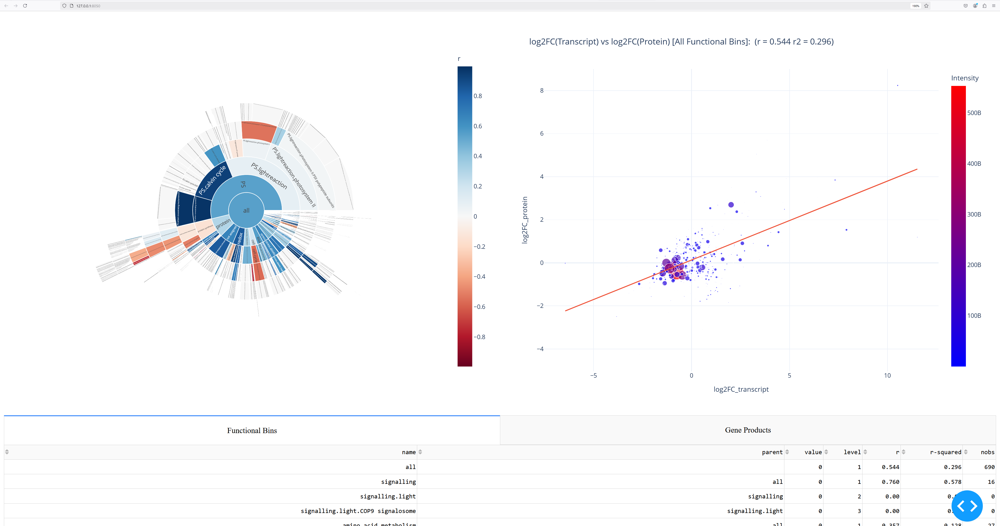

# TPCA: Transcripto-Proteomic Correlation Analyser

TPCA makes it easy to interactively visualise and explore correlations between 
expression level responses of transcripts and proteins to experimental perturbation
across hierarchical functional bins.

For input, you need two Excel (*.xlsx) files:
1. Transcriptomic response data
2. Proteomic response data

Each file needs to have a column containing unique cross-matching gene IDs 
(for joining the tables together on Gene ID match)

One of the files needs to have a column containing "."-delimited hierarchical 
functional bin labels for each gene. For example: 

- "protein.protein synthesis.ribosome"
- "protein.protein synthesis.ribosome.40S subunit"
- "protein.protein synthesis.ribosome.60S subunit"

The provided example data are from the peer-reviewed scientific article:

Zhang et al. (2024) Systems analysis of long-term heat stress responses in the C4 grass Setaria viridis. The Plant Cell

```
from tpca import TPCA
tpca = TPCA()

# Customise configuration parameters as necessary. See all the configurable keys in tpca.py

config = {

    # provide the path to the proteomic data table (*.xlsx)
    'protein_data_file': 'data/Peng_Setaria_Protein_Data_20240521.xlsx',

    # provide the path to the transcriptomic data table (*.xlsx)
    'transcript_data_file': 'data/Peng_Setaria_Transcript_Data_20240521.xlsx',

}

tpca.configure(config)

# read the two data files, filter out bad data, join the tables
tpca.prepare()

options = {'write_html': True}
tpca.analyse_TP_fbins(["all"], options)
tpca.plot(options)
```

Output:
- The sunburst plot on the left represents the total abundance of protein (sum of abundance values) in the 
hierarchical functional bins (as the size of the "pie slice") and the Pearson correlation coefficient between 
transcript and protein log2FC values. Clicking on a functional bin in the sunburst plot will update the scatter plot.
- The scatter plot on the right plots the log2FC values of transcripts and their corresponding proteins against 
each other. The size and color of each data point are proportional to the abundance value for each protein 
(the value in the "Intensity" column in this example). If the selection tools on the scatterplot are used 
to select datapoints in the scatter plot, the Gene Products table below will be updated to reflect the selection.

